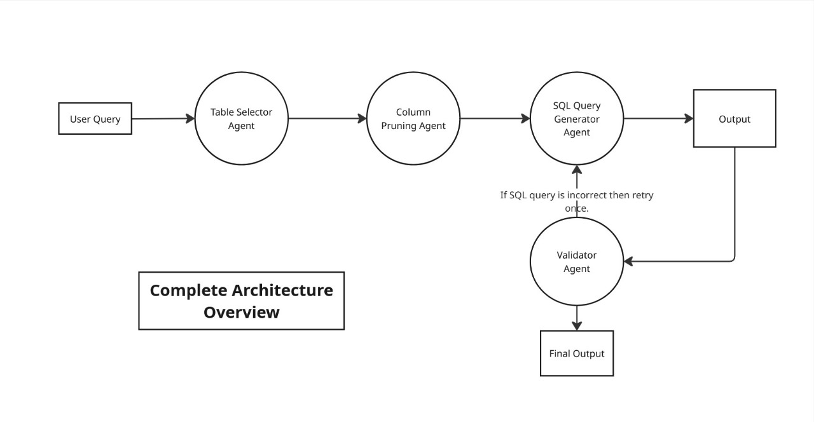
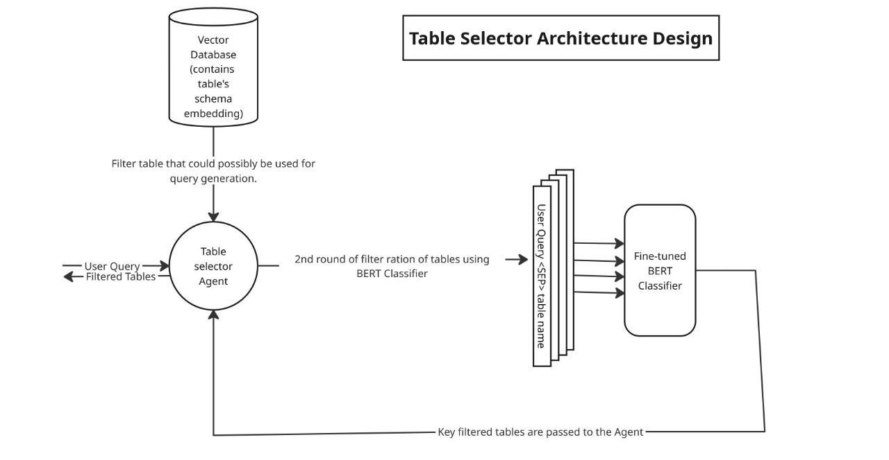
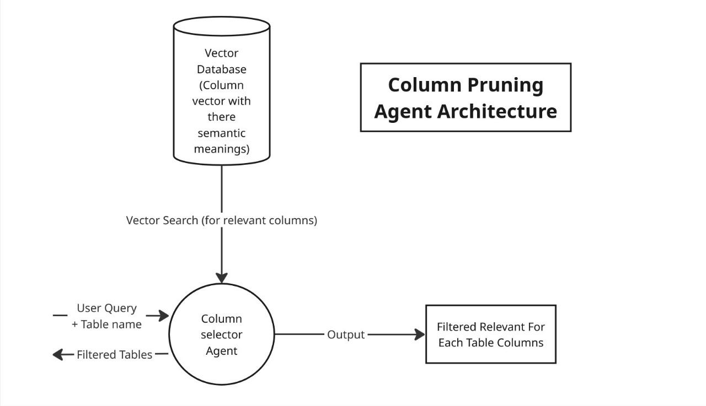
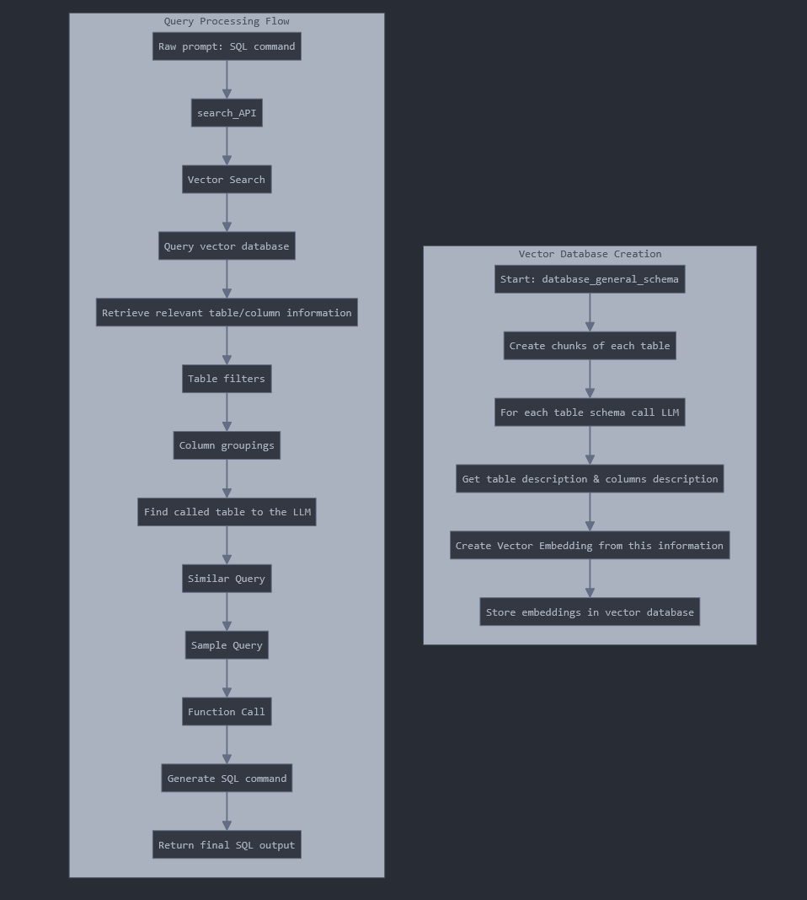

# Text-to-SQL Conversion Engine with RAG-Enhanced LLM Pipeline

A robust system for converting natural language queries into precise SQL statements using a multi-stage pipeline combining Retrieval-Augmented Generation (RAG) and Language Model (LLM) processing.



## 📋 Project Overview

This project implements an advanced natural language to SQL conversion system that enhances query generation through a specialized pipeline:

1. **Table Selection**: Identifies the most relevant tables needed for a given query
2. **Column Pruning**: Determines the essential columns from those tables
3. **SQL Generation**: Constructs accurate SQL queries using the filtered schema and similar examples

The system combines vector database similarity search (RAG) with strategic LLM prompting to achieve improved results compared to single-step conversion approaches.

## 🏗️ System Architecture

The pipeline consists of the following components:

1. **RAG-Based Table Selection**: Uses vector similarity to identify potentially relevant tables
2. **LLM-Based Table Refinement**: Determines which tables are truly necessary for the query
3. **Column Pruning**: Filters columns to include only those needed for the query
4. **Similar Query Retrieval**: Finds analogous queries from the training data to serve as examples
5. **Final SQL Generation**: Creates the SQL query using the pruned schema and example queries





## 🛠️ Key Components

### Database and Schema Management
- Vector database for storing embeddings of table schemas and example queries
- PostgreSQL integration for storing and retrieving data

### NLP and LLM Integration
- Embedding generation using text-embedding-ada-002
- LLM-powered processing using Groq API with Qwen and Llama models
- Multi-stage prompting strategy for improved query accuracy

### RAG Implementation
- Schema embedding and retrieval
- Similar query identification based on vector similarity
- Integration of retrieved context into LLM prompting

## 📦 Core Files

- **`main.py`**: Orchestrates the complete pipeline and evaluates query accuracy
- **`single_pipeline.py`**: Implements the individual pipeline components (table selection, column pruning, SQL generation)
- **`RAG/embedding_creator.py`**: Handles embedding generation and vector search for tables and example queries
- **`RAG/db_conf.py`**: Database connection configuration
- **`test_schema_embedding.py`**: Utilities for schema embedding and vector database operations

## 📊 Performance Metrics

| Metric Type | Component | Performance |
|------------|-----------|-------------|
| Tokens     | Table Selection | ~500 |
|            | Column Pruning  | ~800 |
|            | SQL Generation  | ~1200 |
| Time (sec) | Table Selection | 0.8s |
|            | Column Pruning  | 1.2s |
|            | SQL Generation  | 1.5s |
| **Totals** | Tokens/Query    | ~2500 |
|            | Time/Query      | 3.5s  |

## �‍💻 User Interface

The project features an interactive web interface built with Streamlit, allowing users to easily:
- Input natural language queries
- Visualize each stage of the Text-to-SQL pipeline
- See generated SQL queries and performance metrics in real-time

The interface is implemented in `view.py` which:
- Provides a clean dashboard for query input
- Shows step-by-step processing with visual cues
- Displays performance metrics for each stage
- Presents the final SQL query with syntax highlighting

## �🚀 Getting Started

### Prerequisites
- Python 3.10+
- PostgreSQL database with pgvector extension
- Required Python packages (see requirements.txt)
- API keys for LLM services (Groq, Azure OpenAI)

### Installation

1. Clone the repository:
   ```bash
   git clone https://github.com/dash-dash-org/Adobe.git
   cd Adobe
   ```

2. Install dependencies:
   ```bash
   pip install -r requirements.txt
   ```

3. Set up environment variables:
   ```bash
   # Create .env file with necessary API keys
   GROQ_API_KEY_RAG=your_api_key
   AZURE_OPENAI_API_KEY_GPT4=your_api_key
   AZURE_OPENAI_ENDPOINT=your_endpoint
   ```

### Using the Pipeline

#### Streamlit Web Interface

Launch the user-friendly web interface:

```bash
streamlit run view.py
```

This opens an interactive dashboard where you can:
1. Enter natural language queries in plain English
2. Watch as the system processes each stage of the pipeline
3. View the selected tables and columns
4. Get the final SQL query with syntax highlighting
5. See detailed performance metrics for each step

#### Command Line Usage

Run the main script with your test data:

```python
python main.py
```

Or use the single pipeline directly in your own code:

```python
from single_pipeline import table_agent, prune_agent, final_sql_query_generator
import RAG.embedding_creator as search_api

# Get relevant tables through RAG
relevant_tables = search_api.search_tables(nl_query)

# Refine tables through LLM
refined_tables, tokens = table_agent(nl_query, relevant_tables)

# Prune columns
relevant_schema, tokens = prune_agent(nl_query, refined_tables)

# Get similar queries as examples
similar_queries = search_api.search_similar_query(nl_query)

# Generate SQL query
sql_query, tokens = final_sql_query_generator(nl_query, relevant_schema, similar_queries)
```

## 🔬 How It Works

The system processes natural language queries through multiple stages:

1. **Initial RAG Search**: Converts the query to an embedding and finds similar tables in the vector database
2. **Table Agent**: Uses an LLM to analyze which tables are actually required
3. **Column Pruning**: Determines which columns from the selected tables are necessary 
4. **Similar Query Search**: Finds examples of similar queries and their SQL translations
5. **SQL Generation**: Combines the pruned schema and examples to generate the final SQL



This multi-step process achieves better results than single-step conversion by breaking down the complex task into manageable components.

## 🤝 Contributing

Contributions are welcome! Please feel free to submit a Pull Request.

## 👏 Acknowledgments

- Groq for providing fast LLM inference
- Azure OpenAI for embedding generation
- pgvector for efficient vector similarity search