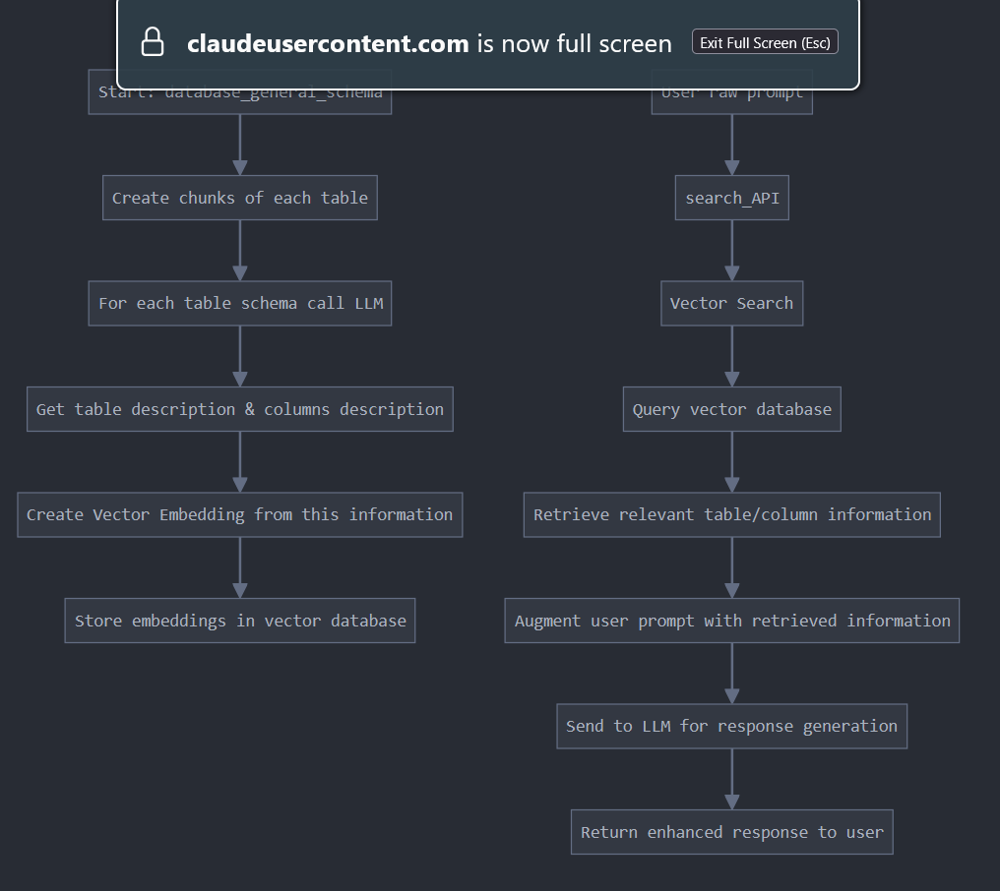

## System Flow Charts

### Vector Database Creation

### Query Processing Flow

## Detailed Process Steps

### A. Vector Database Creation

1. **Start with database_general_schema**: Initialize the process with the general database schema that contains all table definitions.

2. **Create chunks of each table**: Break down the database schema into manageable chunks, focusing on individual tables and their relationships.

3. **For each table schema call LLM**: Use a Large Language Model to analyze and understand each table's structure, relationships, and purpose.

4. **Get table description & columns description**: Extract detailed descriptions of tables and their columns, including data types, constraints, and semantic meaning.

5. **Create Vector Embedding from this information**: Generate vector embeddings from the table and column descriptions, creating a numerical representation that captures semantic meaning.

6. **Store embeddings in vector database**: Save these vector embeddings in a specialized vector database for efficient similarity searching.

### B. Query Processing Flow

1. **Raw prompt: SQL command**: Begin with a user's raw SQL command or query request.

2. **search_API**: Pass the raw query to the search API that was created earlier.

3. **Vector Search**: Initiate a vector search process using the embedded query.

4. **Query vector database**: Search the vector database containing the table and column embeddings.

5. **Retrieve relevant table/column information**: Fetch the most semantically relevant table and column information based on similarity scores.

6. **Table filters**: Apply filters to narrow down the relevant tables based on the query context.

7. **Column groupings**: Group related columns that might be needed for the query.

8. **Find called table to the LLM**: Identify which specific tables need to be referenced and send this information to the LLM.

9. **Similar Query**: Generate similar queries that match the pattern of the user's intent.

10. **Sample Query**: Create sample queries that demonstrate how to properly structure the desired SQL command.

11. **Function Call**: Make necessary function calls to process the data and prepare for SQL generation.

12. **Generate SQL command**: Create the optimized SQL command based on all gathered information.

13. **Return final SQL output**: Return the final, optimized SQL command to the user.

## Integration Notes

This RAG system functions as part of a larger program, enhancing SQL query capabilities through AI-driven database understanding. The vector search API created earlier serves as a crucial component that bridges the user's raw query intent with the database's structure and semantics.

The overall flow represents a gen AI agentic system that translates user requirements into optimized database queries by leveraging contextual understanding of the database schema.

# RAG System Documentation

This document provides a comprehensive overview of the Retrieval-Augmented Generation (RAG) system designed to enhance SQL query processing through intelligent database schema understanding.

## System Flow Chart

    

## Detailed Process Steps

### A. Vector Database Creation

1. **Start with database_general_schema**: Initialize the process with the general database schema that contains all table definitions.

2. **Create chunks of each table**: Break down the database schema into manageable chunks, focusing on individual tables and their relationships.

3. **For each table schema call LLM**: Use a Large Language Model to analyze and understand each table's structure, relationships, and purpose.

4. **Get table description & columns description**: Extract detailed descriptions of tables and their columns, including data types, constraints, and semantic meaning.

5. **Create Vector Embedding from this information**: Generate vector embeddings from the table and column descriptions, creating a numerical representation that captures semantic meaning.

6. **Store embeddings in vector database**: Save these vector embeddings in a specialized vector database for efficient similarity searching.

### B. Query Processing Flow

1. **Raw prompt: SQL command**: Begin with a user's raw SQL command or query request.

2. **search_API**: Pass the raw query to the search API that was created earlier.

3. **Vector Search**: Initiate a vector search process using the embedded query.

4. **Query vector database**: Search the vector database containing the table and column embeddings.

5. **Retrieve relevant table/column information**: Fetch the most semantically relevant table and column information based on similarity scores.

6. **Table filters**: Apply filters to narrow down the relevant tables based on the query context.

7. **Column groupings**: Group related columns that might be needed for the query.

8. **Find called table to the LLM**: Identify which specific tables need to be referenced and send this information to the LLM.

9. **Similar Query**: Generate similar queries that match the pattern of the user's intent.

10. **Sample Query**: Create sample queries that demonstrate how to properly structure the desired SQL command.

11. **Function Call**: Make necessary function calls to process the data and prepare for SQL generation.

12. **Generate SQL command**: Create the optimized SQL command based on all gathered information.

13. **Return final SQL output**: Return the final, optimized SQL command to the user.

## Integration Notes

